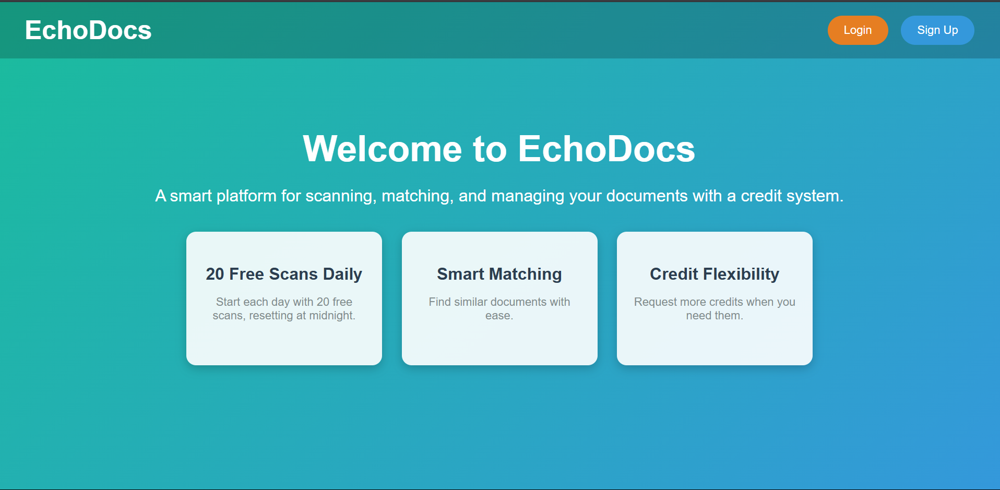
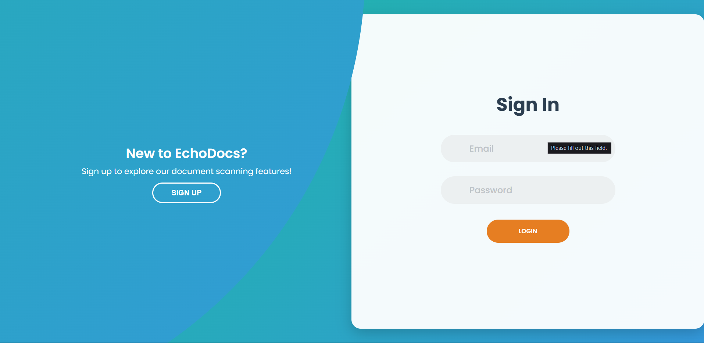
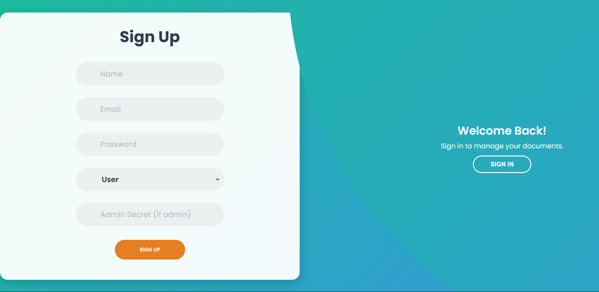
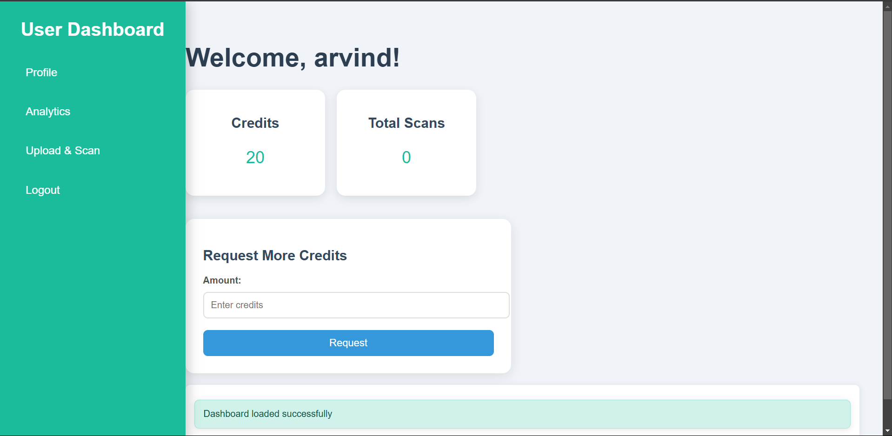
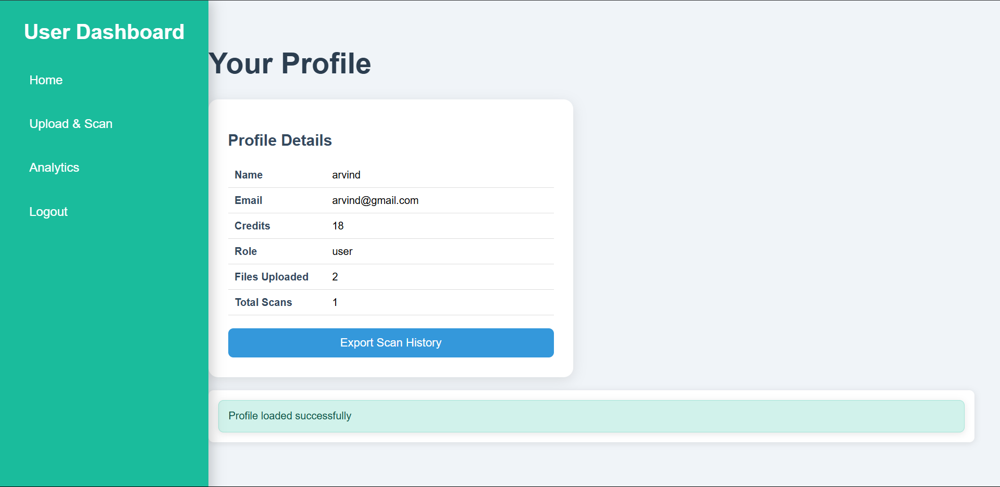
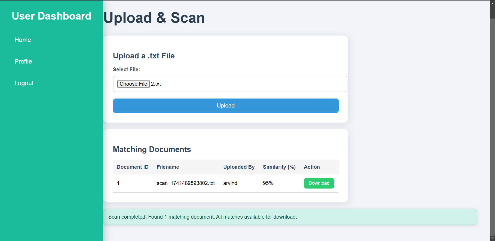
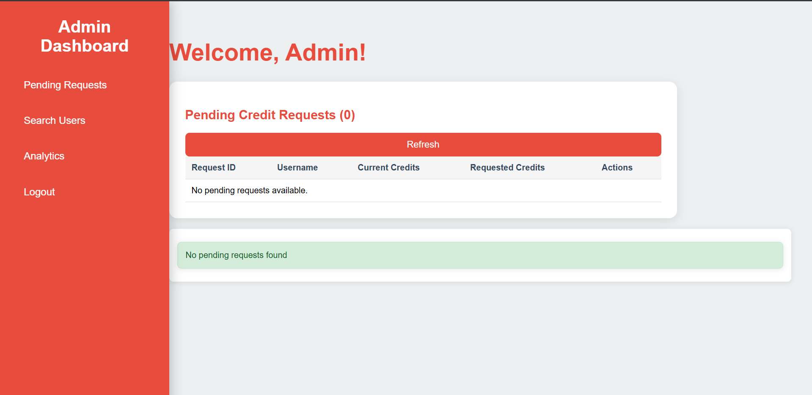
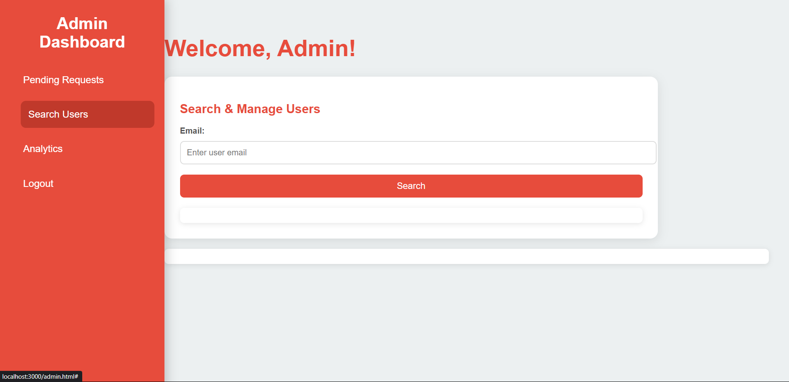
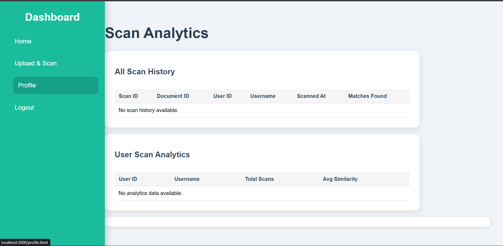
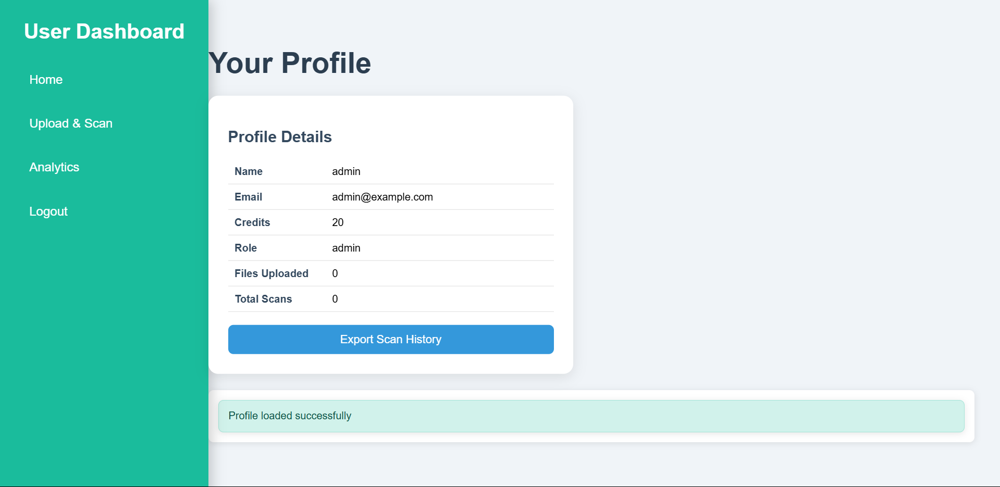

# EchoDocs

EchoDocs is a web application that allows users to upload text files, scan them for similarity against existing documents, manage credits, and download matching files. It includes an admin dashboard for managing user credit requests, searching users by email, and adjusting credits, as well as a user dashboard for uploading files, requesting credits, and exporting scan history. The application uses SQLite for data storage, Express.js for the backend, and vanilla JavaScript with HTML/CSS for the frontend.

## Features

### User Features
- **Register and Login:** Users can create accounts and log in securely via the `/login.html` page.
- **File Upload and Scan:** Upload `.txt` files on the `/upload.html` page and scan for similar documents (similarity > 70%) using Google’s Gemini API.
- **Download Matches:** Download all matching files identified during a scan directly from the upload page.
- **Credit System:** Users start with 20 credits, lose 1 per upload/scan, and can request more from admins via the `/user.html` dashboard.
- **Dashboard:** View current credits, total scans, and request additional credits on the `/user.html` page.
- **Profile:** View profile details (name, email, credits, role, files uploaded, total scans) and export scan history on the `/profile.html` page.

### Admin Features
- **Manage Credit Requests:** Approve or reject user credit requests with custom amounts on the `/admin.html` dashboard under the "Pending Requests" section.
- **User Management:** Search users by email and adjust their credits manually on the `/search.html` page.
- **Analytics:** View scan history and user scan analytics (e.g., total scans, average similarity) on the `/analytics.html` page.
- **Pre-seeded Admin:** An admin account (`admin@example.com / admin12345`) is created on setup.

### Or Use this key while registering a new Admin:
   ```bash
   supersecretadmin
   ```

### General Features
- **Daily Credit Reset:** Credits reset to 20 for users with less than 20 every midnight.
- **Authentication:** JWT-based authentication for secure access.
- **Responsive UI:** Clean, modern interface with styled success/error messages.

## Screenshots

### Main Page
  
*Welcome to EchoDocs with features like 20 Free Scans Daily, Smart Matching, and Credit Flexibility.*

### Sign-In Page
  
*Users can log in with their email and password, with an option to sign up.*

### Sign-Up Page
  
*New users can register with name, email, password, user role, and admin secret (if applicable).*

### User Dashboard
  
*View credits, total scans, and request more credits.*

### User Profile
  
*Display profile details and export scan history.*

### Upload & Scan Page
  
*Upload a `.txt` file and download matching documents (e.g., 95% similarity).*

### Admin Dashboard
  
*Manage pending credit requests (currently 0 pending).*

### Admin Search Users
  
*Search and manage users by email.*

### Admin Analytics
  
*View all scan history and user scan analytics.*

### Admin Profile
  
*Admin profile details with a success message.*

---

## Prerequisites

- **Node.js** (v14.x or later)
- **npm** (v6.x or later)
- **SQLite** (comes with `better-sqlite3`, no separate install needed)
- A Google Generative AI API key (for similarity scanning)

## Installation

1. **Clone the Repository:**
   ```bash
   git clone <repository-url>
   cd EchoDocs
   ```

2. **Install Dependencies:**
   ```bash
   npm install
   ```

3. **Set Up Environment Variables:**
   Create a `.env` file in the root directory with the following:
   ```plaintext
   PORT=3000
   JWT_SECRET=your_jwt_secret_here
   GEMINI_API_KEY=your_google_gemini_api_key_here
   ADMIN_SECRET=supersecretadmin
   ```
   - Replace `your_jwt_secret_here` with a secure secret key.
   - Replace `your_google_gemini_api_key_here` with your Google Generative AI API key.
   
   ```plaintext
   Note: I have intentionally shared my .env file, which contains the API key, to allow testers to run the code effortlessly. This is a deliberate decision to facilitate testing, and I am aware of the security implications. I am not irresponsible; this is for development and testing purposes only. In a production environment, please ensure to secure your .env file and never expose sensitive information like API keys.

4. **Initialize the Database:**
   The database (`database.sqlite`) is created automatically when you start the server, setting up tables for users, credit requests, documents, and scan history.

5. **The Admin User:**
   An admin user with email `admin@example.com` and password `admin12345` is already present.

6. **Start the Server:**
   ```bash
   npm start
   ```
   The server runs on `http://localhost:3000` (or your specified `PORT`).

## Usage

1. **Access the Application:**
   - Open `http://localhost:3000` in your browser to view the homepage (`/index.html`).
   - Static files (HTML, CSS, JS) are served from the `public` directory.

2. **User Workflow:**
   - Register or log in at `/login.html`.
   - Visit `/user.html` to see your dashboard (credits, total scans, request more credits).
   - Upload a `.txt` file at `/upload.html` to scan for similar documents and download matches.
   - View and manage your profile at `/profile.html`, including exporting scan history.

3. **Admin Workflow:**
   - Log in as the admin (`admin@example.com / admin12345`) at `/login.html`.
   - Visit `/admin.html` to manage pending credit requests or adjust user credits.
   - Search for users by email at `/search.html`.
   - View analytics at `/analytics.html` for scan history and user statistics.

## File Structure

```
EchoDocs/
├── config/
│   ├── CreditRequestTable.js   # Credit requests table
│   ├── Database.js            # SQLite setup
│   ├── DocumentTable.js       # Documents/scan_history tables
│   ├── seedAdmin.js           # Seeds admin user
│   ├── UserActivityTable.js   # User activity logs table
│   └── UserTable.js           # Users table with credit reset
├── controllers/
│   └── UserController.js      # API logic
├── entities/
│   └── User.js               # User class
├── middlewares/
│   └── authMiddleware.js     # JWT authentication
├── public/
│   ├── css/
│   │   ├── admin.css        # Admin styles
│   │   ├── analytics.css    # Analytics styles
│   │   ├── auth.css        # Auth styles
│   │   ├── home.css        # Home styles
│   │   ├── profile.css     # Profile styles
│   │   ├── search.css      # Search styles
│   │   ├── upload.css      # Upload styles
│   │   └── user.css        # User styles
│   ├── js/
│   │   ├── admin.js       # Admin logic
│   │   ├── analytics.js   # Analytics logic
│   │   ├── auth.js        # Auth logic
│   │   ├── home.js        # Home logic
│   │   ├── profile.js     # Profile logic
│   │   ├── search.js      # Search logic
│   │   ├── upload.js      # Upload/scan logic
│   │   └── user.js        # User logic
│   ├── admin.html         # Admin UI
│   ├── analytics.html     # Analytics UI
│   ├── index.html        # Homepage
│   ├── login.html        # Login/Signup UI
│   ├── profile.html      # Profile UI
│   ├── search.html       # Search UI
│   ├── upload.html       # Upload UI
│   └── user.html         # User UI
├── repositories/
│   └── UserRepository.js  # Database queries
├── routes/
│   ├── UserRoutes.js     # User API routes
│   └── documentRoutes.js # Document API routes
├── services/
│   └── UserService.js    # User business logic
├── uploads/             # Stored documents
├── utils/
│   └── uploadFile.js    # Multer for file uploads
├── .env                 # Environment variables
├── database.sqlite      # SQLite database
├── package.json         # Dependencies/scripts
└── server.js           # Express server
```

## API Endpoints

### User Routes
- **POST `/api/users/register`** - Register a new user.
- **POST `/api/users/login`** - Log in and receive a JWT token.
- **POST `/api/users/request-credits`** - Request additional credits (authenticated).
- **POST `/api/users/uploadscan`** - Upload and scan a `.txt` file (authenticated).
- **GET `/api/users/profile`** - Get user profile (authenticated; admins can search by email).
- **GET `/api/users/scan-history`** - Get scan history and total scan count (authenticated).
- **GET `/api/users/download/:filename`** - Download a file by filename (authenticated).

### Admin Routes
- **GET `/api/users/pending-requests`** - List pending credit requests (admin only).
- **POST `/api/users/approve-credits`** - Approve or reject credit requests (admin only).
- **POST `/api/users/admin/adjust-credits`** - Manually adjust user credits (admin only).

## Dependencies

- **express**: Web framework
- **better-sqlite3**: SQLite database driver
- **bcrypt**: Password hashing
- **jsonwebtoken**: JWT authentication
- **@google/generative-ai**: Similarity scanning
- **multer**: File uploads (assumed in `uploadFile.js`)
- **node-schedule**: Daily credit reset
- **dotenv**: Environment variable management

Install with:
```bash
npm install express better-sqlite3 bcrypt jsonwebtoken @google/generative-ai multer node-schedule dotenv
```
## License

This project is unlicensed—feel free to use and modify it as needed.
---